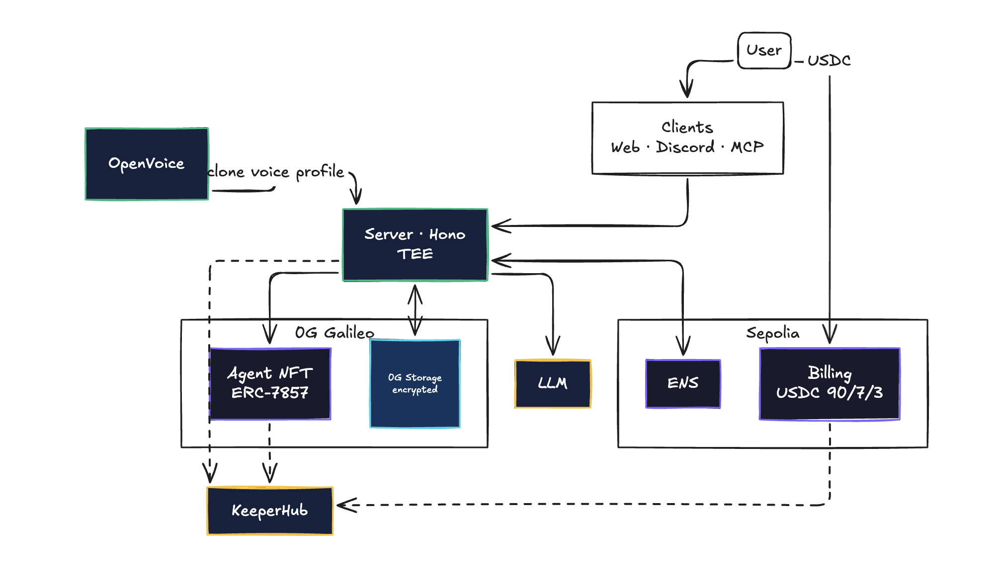

# taars


> **Your AI Replica. Your Identity. Your Rules.**
>
> Creator-owned AI replicas — INFT (ERC-7857) on **0G Chain**, identity via **ENS** subnames, per-minute USDC billing settled with guaranteed onchain execution by **KeeperHub**.

- 🌐 **Live demo:** https://0g-taars.vercel.app/
- 🧬 **Sample replica:** [`skywalker.taars.eth`](https://0g-taars.vercel.app/skywalker)
- 🌳 **ENS subnames (Sepolia):** https://sepolia.app.ens.domains/taars.eth?tab=subnames
- 📜 **PRD:** [`prd.md`](./prd.md) · **Prizes:** [`prizes.md`](./prizes.md)
- 📣 **Team contact:** Telegram & X — [`@fabianferno`](https://t.me/fabianferno)

---

## What it does (60 seconds)

Anyone can mint an AI replica of themselves: voice samples, personality questions, optional writing samples. The pipeline:

1. **Voice profile** generated by an isolated OpenVoice service (TEE-deployable; raw samples never leave the boundary).
2. **Encrypted artifacts** (soul / skills / voice config) uploaded to **0G Storage** — each blob returns a merkle root that becomes its `dataHash`.
3. **INFT minted on 0G Chain** as `ERC-7857` with `IntelligentData[]` pointing at those storage roots — the on-chain proof of embedded intelligence.
4. **ENS subname** (`<name>.taars.eth`) created on Sepolia via NameWrapper, with 11 text records (`taars.inft`, `taars.storage`, `taars.price`, `taars.voice`, etc.) wrapped in a single `multicall`, then transferred to the user. Whoever owns the name owns the replica.
5. Anyone can chat / voice-call the replica. Each session is gated by an **x402 challenge** and settled on the Sepolia `TaarsBilling` contract; **KeeperHub** workflows fire at lifecycle moments to guarantee execution and emit cross-referenced audit IDs.

---

## Architecture



---

## 🟣 0G — INFT (ERC-7857) submission

**Track:** Best Autonomous Agents, Swarms & iNFT Innovations.

| Component | Value |
|---|---|
| Network | 0G Galileo Testnet (chainId `16602`) |
| **`TaarsAgentNFT` (UUPS proxy)** | [`0xD2063f53Fd1c1353113796B56c45a78A65731d52`](https://chainscan-galileo.0g.ai/address/0xD2063f53Fd1c1353113796B56c45a78A65731d52) |
| Sample minted INFT | tokenId `9` — [mint tx](https://chainscan-galileo.0g.ai/tx/0x4b17c8f8068a081363d00b56d365a23b85842c2be3323891c7c47ab3f76dc73d) |
| Source | [`contracts/contracts/TaarsAgentNFT.sol`](./contracts/contracts/TaarsAgentNFT.sol) · [`IERC7857`](./contracts/contracts/interfaces/IERC7857.sol) · [`IERC7857Metadata`](./contracts/contracts/interfaces/IERC7857Metadata.sol) |

**ERC-7857 features used:**
- `IntelligentData[]` per token — `(dataDescription, dataHash)` triples pointing at encrypted blobs on 0G Storage.
- `iTransfer` — orchestrated re-encryption flow (KeeperHub-attested, see below).
- `iClone` — supports licensed copies of a replica.
- Authorized-users mapping for AI-as-a-Service leasing.

**0G Storage usage:** real `@0gfoundation/0g-ts-sdk` uploads via `Indexer.upload()` + `MemData` — see [`server/src/services/storage.ts`](./server/src/services/storage.ts). Each replica writes three encrypted blobs; the `soul.md` merkle root is canonicalised as `taars.storage` and pulled at chat time to decrypt the system prompt.

**Proof of embedded intelligence (sample replica `skywalker.taars.eth`, owner `0x878a…f6b7`):**

| Blob | Storage Root |
|---|---|
| `soul.md` | `0xc2f9e0c9916a6c635e7a3b015d8062b656007608bd875633db83febbc5e1cd74` |
| `skills.json` | `0x31efd213b32866131a81d1e0b6229a634c6fc8d3179591a8ee490f34703974ad` |
| `voice.json` | `0x6d06ba956e2c2a2d26d4a24761136bbc241ffd01d7a3de8d7b4a1744a425d68f` |

**TEE narrative (honest):** the voice cloning service in [`openvoice/`](./openvoice/) runs as an isolated process. It is designed to be deployed inside a TEE (Phala / Marlin / Nautilus-class GPU enclave) so raw voice samples never leave the trusted boundary; only the trained voice profile reaches 0G Storage. In this repo it runs as a standalone HTTP service for local dev.

---

## 🌳 ENS submission

**Track:** Best ENS Integration for AI Agents.

| Field | Value |
|---|---|
| Network | Sepolia |
| Parent name | [`taars.eth` (Sepolia ENS app)](https://sepolia.app.ens.domains/taars.eth?tab=subnames) |
| Sample subname | [`skywalker.taars.eth`](https://sepolia.app.ens.domains/skywalker.taars.eth) |
| Source | [`server/src/services/ens.ts`](./server/src/services/ens.ts) |

**Why ENS is structural, not cosmetic:**
- The ENS name **is** the agent address. Owning `<label>.taars.eth` *is* owning the replica — INFT ownership and ENS ownership move together (the mint pipeline ends with a NameWrapper `safeTransferFrom` to the user).
- The text records form a **structured agent manifest** that any third-party app can resolve and consume:

| Record | Value | Purpose |
|---|---|---|
| `taars.inft` | `0g:16602:<tokenId>` | INFT pointer on 0G Chain |
| `taars.storage` | `0x…` | 0G Storage merkle root for the encrypted soul |
| `taars.voice` | string | Voice profile id |
| `taars.price` | `0.05` | Per-minute rate (USD) |
| `taars.currency` | `USDC` | Payment asset |
| `taars.network` | `sepolia` | Settlement chain |
| `taars.owner` | `0x…` | Canonical owner mirror (verified against 0G `ownerOf`) |
| `taars.created`, `taars.version` | — | Lineage metadata |
| `description`, `url`, `avatar` | — | Standard ENS records |

- **Discovery + composability**: `/explore` and `/[ensName]` pages on the app resolve agents from ENS itself, not a private database. The chat pipeline (`server/src/routes/chat.ts`) reads `taars.storage` from the resolver to fetch + decrypt the soul, and `taars.price` to seed the x402 paywall — text records are load-bearing, not decorative.

**Implementation highlights** ([ens.ts](./server/src/services/ens.ts)):
- ENS v3 ETHRegistrarController commit-reveal for parent registration (idempotent).
- `NameWrapper.setSubnodeRecord` for subnames.
- `PublicResolver.multicall` writes all 11 text records in a single tx.
- Operator pattern: deployer creates → writes records → `safeTransferFrom`s the wrapped 1155 to the user, so the user ends up the on-chain owner of the subname.

---

## 🛠 KeeperHub submission

**Track:** Best Use of KeeperHub (Focus Area 1 — innovative use; Focus Area 2 — payments / x402 integration).

The taars mint + chat + transfer flow is a multi-step coordinated ceremony across 0G Chain, 0G Storage, ENS on Sepolia, and a USDC billing contract. KeeperHub absorbs the reliability problem that would otherwise require custom queue/state-machine code.

**Three production workflows wired** ([keeperhub.ts](./server/src/services/keeperhub.ts)):

| Workflow | ID | Fires from | Purpose |
|---|---|---|---|
| `billingSettle` | `9ucfocpbig3urovmnq6v9` | [`billing.ts`](./server/src/services/billing.ts) (post-settle) | Reads `getRevenue` on Sepolia to attest revenue actually accrued |
| `inftTransfer` | `pgkehp9z83o3yeinkh8r2` | [`transfer.ts`](./server/src/services/transfer.ts) (post-`iTransfer`) | Reads `ownerOf` on 0G to confirm the new owner is set |
| `discordDeploy` | `49amr3waaqxy9vlw4wznn` | [`deploy.ts`](./server/src/routes/deploy.ts) (start + end) | Lifecycle audit for live Discord VC bot deploy |

**x402 + payments integration** ([middleware/x402.ts](./server/src/middleware/x402.ts)):
- `/chat/message` and `/chat/transcribe` return a real **HTTP 402** with the `x402` challenge envelope (`scheme: "exact"`, `asset`, `network: sepolia`, `payTo`, `maxAmountRequired` derived from the ENS `taars.price` text record).
- After session settlement on `TaarsBilling`, the `billingSettle` KeeperHub workflow attests the on-chain revenue update — coupling x402 challenge → contract settle → KH attestation into a single audit trail.

**Audit cross-referencing:** every workflow fire writes its `executionId` into `server/.audit/sessions.jsonl` / `deploys.jsonl` / transfer logs, so each on-chain action and each KeeperHub run can be located from either side.

**Verifying your install:**

```bash
# After setting KEEPERHUB_WEBHOOK_BASE + KEEPERHUB_API_KEY in .env
pnpm --filter @taars/server exec tsx scripts/test-keeperhub.ts
# → fires all three workflows with smoke payloads and prints executionIds
```

**Builder feedback bounty:** notes accumulated while integrating live in `docs/` (webhook URL discovery, payload-shape onboarding, etc.).

---

## Sepolia billing — `TaarsBilling` + `MockUSDC`

| Contract | Address |
|---|---|
| `TaarsBilling` | [`0xCE5860AA731439a80F39852b6296057313831870`](https://sepolia.etherscan.io/address/0xCE5860AA731439a80F39852b6296057313831870) |
| `MockUSDC` | [`0x43E342Aa084C15dF16fbaA594986A5Afa9F364C8`](https://sepolia.etherscan.io/address/0x43E342Aa084C15dF16fbaA594986A5Afa9F364C8) |

90 / 7 / 3 revenue split (INFT owner / treasury / original creator), enforced even after INFT transfer. Owner verified against the canonical 0G `ownerOf`.

---

## Layout

```
taars/
├── web/         Next.js 15 PWA (Privy embedded wallet)
├── server/      Hono backend — mint pipeline, chat, billing, deploy, KeeperHub
├── contracts/   Hardhat — TaarsAgentNFT (ERC-7857) + TaarsBilling
├── sdk/         Shared TS types + ABIs
├── openvoice/   Python OpenVoice service (TEE-deployable)
├── discord-bot/ Live Discord VC bot
├── mcp/         taars MCP server (resolve / chat by ENS name)
└── docs/        Plans, specs, integration notes
```

## Setup

```bash
pnpm install
cp .env.example .env
# fill DEPLOYER_PRIVATE_KEY, NEXT_PUBLIC_PRIVY_APP_ID, ENCRYPTION_KEY,
# TAARS_INFT_ADDRESS, TAARS_BILLING_ADDRESS, MOCK_USDC_ADDRESS,
# KEEPERHUB_WEBHOOK_BASE, KEEPERHUB_API_KEY, DISCORD_BOT_TOKEN
```

## Build & test

```bash
pnpm contracts:compile
pnpm contracts:test
pnpm sdk:abi
pnpm --filter @taars/server typecheck
pnpm --filter @taars/server test
pnpm --filter @taars/server exec tsx scripts/test-keeperhub.ts   # KH smoke test
```

## Run

```bash
cd openvoice && python http_server.py        # :5005 (TEE in prod)
pnpm server:dev                                # :8080
pnpm web:dev                                   # :3000
```

## Deploy contracts

```bash
DEPLOYER_PRIVATE_KEY=0x... pnpm --filter @taars/contracts deploy:0g
# updates contracts/deployments/og-testnet.json with the proxy address
```

---

## Team

- **Fabian Ferno** — Telegram [`@fabianferno`](https://t.me/fabianferno) · X [`@fabianferno`](https://x.com/fabianferno)
