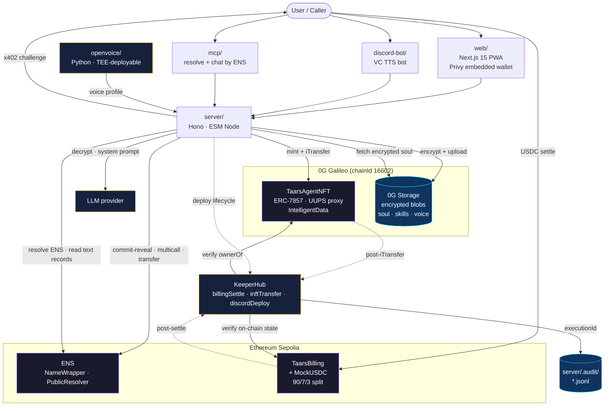

# taars — ETHGlobal Open Agents submission

## Project name
taars

## Category
Artificial Intelligence

## Emoji
🧬

## Demo
- Live demo: https://0g-taars.vercel.app/
- Sample replica: https://0g-taars.vercel.app/skywalker
- Demo video: <ADD 3-MIN VIDEO LINK>
- Source: https://github.com/fabianferno/taars

## Short description (≤100 chars)
Mint yourself as an AI. Own the ENS, own the INFT, earn USDC every minute someone chats.

## Description (min 280 chars)
taars is a protocol for **sovereign AI replicas of real people** — your voice, your personality, your writing style, minted as an ERC-7857 Intelligent NFT (INFT) on 0G Chain and identified by an ENS subname (`<you>.taars.eth`) that *is* the replica's address on the open internet. The same wallet that owns the ENS name owns the INFT. There is no central database mapping names to agents — every replica is fully described by what's on-chain (the INFT and its `IntelligentData[]` roots) and what's in 0G Storage (the encrypted soul, skills, and voice profile). Anyone with a wallet, an ENS resolver, and an HTTP client can find a replica and talk to it.

When you mint, four things happen as one ceremony. (1) Your voice samples are processed by an isolated OpenVoice service designed for TEE deployment, so raw audio never leaves the trusted boundary — only a trained, encrypted voice profile does. (2) Three encrypted artifacts are uploaded to 0G Storage: `soul.md` (your system prompt and personality), `skills.json` (capabilities, tools, knowledge), and `voice.json` (the OpenVoice profile reference). Each upload returns a merkle root. (3) An ERC-7857 token is minted on 0G Galileo whose `IntelligentData[]` array binds those merkle roots on-chain — that's the proof of embedded intelligence. (4) An ENS subname on Sepolia is created and populated with eleven structured text records (`taars.inft`, `taars.storage`, `taars.voice`, `taars.price`, `taars.currency`, `taars.network`, `taars.owner`, `taars.created`, `taars.version`, plus `description`/`url`/`avatar`) in a single `PublicResolver.multicall`, then `safeTransferFrom`'d to the minter as a wrapped ERC-1155.

The text records are **load-bearing infrastructure, not metadata**. The chat pipeline resolves the ENS name → reads `taars.storage` → pulls the encrypted soul from 0G Storage → decrypts → uses it as the system prompt. The x402 paywall reads `taars.price` to compute the challenge amount in real time. Discovery (`/explore`, `/[ensName]`) reads ENS directly. The replica is *literally* defined by what its ENS resolver says it is.

Anyone can chat or voice-call a replica. Every session begins with a real **HTTP 402** response carrying the **x402** challenge envelope; the client pays in USDC on a Sepolia `TaarsBilling` contract, which enforces a 90/7/3 split (current INFT owner / treasury / original creator) — verified live against canonical 0G `ownerOf`, so revenue follows the INFT through transfers. After settlement a **KeeperHub** workflow fires, reads `getRevenue` back from the contract, and emits a cross-referenceable `executionId` into a JSONL audit log on the server. Two more KeeperHub workflows attest `iTransfer` re-encryption (reading 0G `ownerOf` to confirm the new owner) and Discord VC bot deploy lifecycles. Every on-chain action — payment, transfer, deploy — has an independent, deep-linkable audit trail.

The same replica can be deployed into a Discord voice channel: the bot joins a VC, transcribes incoming voice, replies through the LLM, and speaks the response in the cloned voice — all gated by the same paywall and lifecycle-tracked through KeeperHub. Because the agent identity is just an ENS name, third-party clients (an MCP server is included) can resolve and chat with a replica without any taars-specific API.

## How it's made

### System diagram



### Stack

Monorepo on pnpm workspaces. **`web/`** — Next.js 15 App Router PWA with Privy embedded wallets, wagmi/viem for read calls, Tailwind + shadcn/ui, framer-motion, three.js / R3F for the replica viewer. **`server/`** — Hono on `@hono/node-server` (Node ESM, `.js` import suffixes), vitest for tests. **`contracts/`** — Hardhat with OpenZeppelin upgradeable (UUPS), ethers v6, typechain. **`sdk/`** — shared TS types and ABIs regenerated by `pnpm sdk:abi` after every contract change so `web/` and `server/` stay in lockstep. **`openvoice/`** — standalone Python HTTP service (FastAPI-style) running OpenVoice; intentionally outside the pnpm workspace because in production it runs in a TEE GPU enclave. **`discord-bot/`** — discord.js, Opus → Whisper transcription, OpenVoice TTS reply. **`mcp/`** — Model Context Protocol server exposing `resolve(ensName)` and `chat(ensName, message)` so any MCP client can talk to a replica.

### 0G — INFT (ERC-7857)

`TaarsAgentNFT` is a UUPS proxy implementing `IERC7857` + `IERC7857Metadata`, deployed on 0G Galileo testnet (chainId 16602) at `0xD2063f53Fd1c1353113796B56c45a78A65731d52`. The contract stores an `IntelligentData[]` per token — a list of `(dataDescription, dataHash)` triples where each `dataHash` is a 0G Storage merkle root. Every replica writes exactly three entries: `soul`, `skills`, and `voice`. We exercise `iTransfer` (the re-encryption ceremony for transferring an INFT to a new owner) and `iClone` (licensed copies for AI-as-a-Service leasing). The contract also maintains an authorized-users mapping for read-only access without ownership transfer.

**0G Storage uploads use the real SDK** — `@0gfoundation/0g-ts-sdk` `Indexer.upload(MemData, …)` — see `server/src/services/storage.ts`. Encryption happens *before* upload in `server/src/services/encrypt.ts` (AES with `ENCRYPTION_KEY`), so what 0G sees is opaque ciphertext; the merkle root commits to the ciphertext, and the decryption key is held by the agent operator. At chat time the server resolves ENS → reads `taars.storage` → pulls the encrypted soul → decrypts → uses it as the LLM system prompt. The merkle roots aren't just pointers; they're the canonical proof that a specific token corresponds to specific intelligence.

Mint orchestration lives in `server/src/services/inft.ts` and `routes/mint.ts`. Galileo RPC has a known issue where `eth_getTransactionReceipt` returns "not found" for valid txs for 10–30 seconds after broadcast, so we wrote `waitForReceiptResilient` (inft.ts:66–102) — a poller that tolerates transient `not found` for up to eight minutes. Standard `viem.waitForTransactionReceipt` fails on this.

### ENS — identity, not cosmetics

Parent `taars.eth` is registered on Sepolia via the v3 ETHRegistrarController (`0xFED6a969AaA60E4961FCD3EBF1A2e8913ac65B72`) using a commit-reveal flow (idempotent, so re-runs are safe). All replica logic lives in `server/src/services/ens.ts`:

1. `NameWrapper.setSubnodeRecord(parent, label, owner=operator, resolver=PublicResolver, ttl=0, fuses=0, expiry=type(uint64).max)` — the wrapper auto-caps expiry at parent expiry, so this is the right "subname forever" pattern.
2. **All eleven text records in one tx** via `PublicResolver.multicall([...11 setText calls...])`. This is the single most impactful gas optimization in the pipeline — 11 records would otherwise be 11 transactions and 11 user-facing loading states; multicall collapses it to one. Cost dropped roughly 10×.
3. `NameWrapper.safeTransferFrom(operator, user, tokenId)` — hands the wrapped ERC-1155 to the user, who is now the canonical on-chain owner.

The **operator pattern** (deployer key creates → writes records → transfers) is what makes this a single ceremony from the user's perspective. They sign one Privy transaction at the front of the flow; the rest is operator-mediated and finishes with them owning the subname.

The chat pipeline (`server/src/routes/chat.ts`) and the discovery pages (`web/src/app/[ensName]`, `/explore`) read agents *directly* from ENS resolver text records — no private DB. `taars.storage` is read to fetch the soul; `taars.price` is read to seed the x402 paywall amount. Text records are infrastructure.

### x402 paywall

`server/src/middleware/x402.ts` returns a real **HTTP 402** with the x402 challenge envelope on `/chat/message` and `/chat/transcribe`:

```json
{
  "x402Version": 1,
  "accepts": [{
    "scheme": "exact",
    "network": "sepolia",
    "asset": "<MockUSDC address>",
    "payTo": "<TaarsBilling address>",
    "maxAmountRequired": "<derived from ENS taars.price>"
  }]
}
```

`maxAmountRequired` is derived **live** from the agent's ENS `taars.price` text record, not a config constant. The client pays on `TaarsBilling` (`0xCE5860AA731439a80F39852b6296057313831870`), which enforces the 90/7/3 split (owner / treasury / original creator) and verifies the owner against canonical 0G `ownerOf` so revenue follows INFT transfers. Post-settle the `billingSettle` KeeperHub workflow attests, closing a single audit loop: **x402 challenge → contract settle → KH attestation**.

### KeeperHub — guaranteed execution + audit

Three production workflows are wired in `server/src/services/keeperhub.ts`. Each fires from a specific server route, reads on-chain state to attest the action actually landed, and writes its `executionId` into a JSONL audit log:

| Workflow | ID | Fires from | What it attests |
|---|---|---|---|
| `billingSettle` | `9ucfocpbig3urovmnq6v9` | `services/billing.ts` (post-settle) | Reads `getRevenue` on Sepolia |
| `inftTransfer` | `pgkehp9z83o3yeinkh8r2` | `services/transfer.ts` (post-`iTransfer`) | Reads `ownerOf` on 0G |
| `discordDeploy` | `49amr3waaqxy9vlw4wznn` | `routes/deploy.ts` (start + end) | Lifecycle audit for the VC bot |

Audit cross-reference lives in `server/.audit/{sessions,deploys,transfers}.jsonl`. Each entry pairs the on-chain tx hash with the KH `executionId`, so any payment / transfer / deploy can be traced from either side. KeeperHub's `web3/get-transaction` and `web3/read-contract` action nodes covered every "did the tx land?" / "what's the on-chain state now?" need without custom action code.

### TEE narrative (honest)

The OpenVoice service runs as an isolated process designed for TEE deployment (Phala / Marlin / Nautilus-class GPU enclaves) so raw voice samples never leave the trusted boundary; only the trained, encrypted voice profile is uploaded to 0G Storage. In this repo it runs as a standalone HTTP service on `:5005` for local dev. The boundary is real — voice samples never enter the Hono server's address space — but the production TEE deployment is post-hackathon work.

### Notable hacky bits

- **One-multicall mint** — eleven ENS text records in a single tx via `PublicResolver.multicall`, ~10× gas reduction and one user-facing loading state.
- **Operator-pattern subname ceremony** — deployer creates → writes records → `safeTransferFrom`s the wrapped 1155, all atomic from the user's perspective. The user signs one Privy tx and ends up the canonical on-chain owner.
- **Resilient receipt poller** for Galileo RPC's transient "not found" window (`services/inft.ts`), tolerates ~8 minutes of indexer flakiness.
- **ENS as zero-DB agent registry** — chat pipeline, paywall, and discovery all read ENS resolver text records as their source of truth.
- **One audit ID across three layers** — x402 challenge ID → on-chain settle tx → KH `executionId`, all cross-referenced in JSONL so any single record locates the other two.
- **Owner-follows-INFT revenue** — `TaarsBilling` checks 0G `ownerOf` at distribution time, not at session start, so the owner share automatically follows the INFT through transfers without re-configuring the billing contract.

---

## Tech Stack answers

**Ethereum developer tools:** Hardhat, Ethers.js, viem, OpenZeppelin Contracts (UUPS), ENS (NameWrapper, PublicResolver, ETHRegistrarController v3), Privy (embedded wallets), x402.

**Blockchain networks:** 0G Galileo Testnet (chainId 16602), Ethereum Sepolia.

**Programming languages:** TypeScript, Solidity, Python.

**Web frameworks:** Next.js 15 (App Router, PWA), Hono.

**Databases:** None as primary store — ENS resolver text records + 0G Storage are the source of truth. Local JSONL audit logs (`server/.audit/`) for KeeperHub cross-reference.

**Design tools:** Tailwind CSS, shadcn/ui, Figma.

**Other heavy libs/tools:** `@0gfoundation/0g-ts-sdk` (0G Storage), KeeperHub MCP + workflows, OpenVoice (voice cloning), discord.js (VC bot + TTS), MCP SDK (taars MCP server for resolve/chat by ENS name), pnpm workspaces.

## AI tools used in the project
Claude Code (Opus 4.7) was used pair-programming-style across the stack: scaffolding the ERC-7857 contract + tests, wiring the 0G Storage upload pipeline, the ENS multicall + transfer ceremony, the x402 middleware, the KeeperHub workflow integration, and the Discord VC bot's transcribe → reply → TTS loop. OpenVoice (open-source) is the runtime AI model that generates each replica's voice profile. The replica chat itself runs against an LLM provider gated by the x402 paywall.

---

## Partner prizes applying for

### 🟣 0G — Best Autonomous Agents, Swarms & iNFT Innovations
**Why:** taars is an iNFT-native product. Each replica is a real `ERC-7857` token on 0G with `IntelligentData[]` pointing at encrypted soul / skills / voice blobs uploaded via the real `@0gfoundation/0g-ts-sdk`. We exercise `iTransfer` (re-encryption, KH-attested) and `iClone` (licensed copies). Sample minted INFT: tokenId `9` on 0G Galileo.

**Code permalinks:**
- INFT contract — `contracts/contracts/TaarsAgentNFT.sol`: https://github.com/fabianferno/taars/blob/main/contracts/contracts/TaarsAgentNFT.sol
- IERC7857 interface: https://github.com/fabianferno/taars/blob/main/contracts/contracts/interfaces/IERC7857.sol
- 0G Storage uploads — `server/src/services/storage.ts`: https://github.com/fabianferno/taars/blob/main/server/src/services/storage.ts
- iTransfer flow — `server/src/services/transfer.ts`: https://github.com/fabianferno/taars/blob/main/server/src/services/transfer.ts
- Mint tx (tokenId 9): https://chainscan-galileo.0g.ai/tx/0x4b17c8f8068a081363d00b56d365a23b85842c2be3323891c7c47ab3f76dc73d
- INFT contract on 0G Chainscan: https://chainscan-galileo.0g.ai/address/0xD2063f53Fd1c1353113796B56c45a78A65731d52

### 🌳 ENS — Best ENS Integration for AI Agents & 🌳 ENS — Most Creative Use of ENS
**Why:** ENS is the agent's identity, not a label. The subname *is* the replica — owning `<label>.taars.eth` is owning the INFT, and the chat/discovery pipeline reads agents directly from ENS resolver text records (no private DB).


**Why:** Eleven structured text records form a machine-readable **agent manifest** (`taars.inft`, `taars.storage`, `taars.voice`, `taars.price`, `taars.currency`, `taars.network`, `taars.owner`, `taars.created`, `taars.version`, plus `description` / `url` / `avatar`) all written in a single `PublicResolver.multicall`. The x402 paywall amount and the encrypted soul's storage root are both pulled live from ENS — text records are load-bearing infra, not decoration.


**Code permalinks:**
- ENS service (commit-reveal, NameWrapper, multicall, transfer) — `server/src/services/ens.ts`: https://github.com/fabianferno/taars/blob/main/server/src/services/ens.ts
- Chat pipeline reads `taars.storage` + `taars.price` from ENS — `server/src/routes/chat.ts`: https://github.com/fabianferno/taars/blob/main/server/src/routes/chat.ts
- Sample subname: https://sepolia.app.ens.domains/skywalker.taars.eth
- 11-record multicall + operator transfer: https://github.com/fabianferno/taars/blob/main/server/src/services/ens.ts
- Agent discovery from ENS only — `web/` explore/[ensName] pages: https://github.com/fabianferno/taars/tree/main/web/src/app

### 🛠 KeeperHub — Best Use of KeeperHub (Focus Area 1: innovative use; Focus Area 2: x402 payments integration)
**Why:** Three real production workflows wired into the lifecycle (`billingSettle`, `inftTransfer`, `discordDeploy`) — each fires from a specific server route, reads on-chain state to attest the action actually landed, and writes `executionId`s into a JSONL audit log so every on-chain action can be cross-referenced with its KH run. The `billingSettle` workflow closes an x402 challenge → on-chain settle → KH attestation loop.

**Live execution evidence** (visible in our org's KeeperHub dashboard):

| Workflow | ID | Sample executionId | Status |
|---|---|---|---|
| `billingSettle` | `9ucfocpbig3urovmnq6v9` | `m0pqec123y9lkl5ynp3wx` · `4cc8mi4g5z1r1o0n9wmd0` | trigger ✅ → verify on Sepolia |
| `inftTransfer` | `pgkehp9z83o3yeinkh8r2` | `glbkpo2a4nhq679b6a4yp` | trigger ✅ → readOwner on 0G |
| `discordDeploy` | `49amr3waaqxy9vlw4wznn` | `ua32kdqse1nlqkiikzfot` | **fully green ✅** (both nodes succeeded) |

**Code permalinks:**
- KeeperHub service — `server/src/services/keeperhub.ts`: https://github.com/fabianferno/taars/blob/main/server/src/services/keeperhub.ts
- x402 middleware — `server/src/middleware/x402.ts`: https://github.com/fabianferno/taars/blob/main/server/src/middleware/x402.ts
- Billing fire-point — `server/src/services/billing.ts`: https://github.com/fabianferno/taars/blob/main/server/src/services/billing.ts
- Discord deploy fire-point — `server/src/routes/deploy.ts`: https://github.com/fabianferno/taars/blob/main/server/src/routes/deploy.ts
- KH smoke test — `server/scripts/test-keeperhub.ts`: https://github.com/fabianferno/taars/blob/main/server/scripts/test-keeperhub.ts

### 🔍 KeeperHub — Builder Feedback Bounty
**Why:** Honest integration notes captured live during the build (webhook URL discovery, payload-shape onboarding gaps, executionId surfacing) collected in `docs/`.

---

## Sponsor feedback (from building taars)

Specific, code-grounded notes from integrating each sponsor's stack over the
hackathon. All examples are reproducible from this repo.

### 🟣 0G

**What worked well**
- `@0gfoundation/0g-ts-sdk` `Indexer.upload(MemData, …)` is genuinely simple — three lines of TS to upload an encrypted blob and get a merkle root back. Excellent fit for INFT-style "encrypted artifact + on-chain pointer" patterns.
- ERC-7857's `IntelligentData[]` shape (description + dataHash) maps cleanly to the way we already wanted to bundle a replica (soul / skills / voice).
- 0G Galileo is EVM-compatible enough that nothing in our Hardhat / OpenZeppelin / viem toolchain needed special handling.

**Friction (reproducible)**
1. **SDK fork ambiguity.** Two TS SDKs exist with overlapping APIs: `@0glabs/0g-ts-sdk` (0.3.x) and `@0gfoundation/0g-ts-sdk` (1.2.x). The `@0glabs` one reverts on Galileo's Flow contract for some submissions; we landed on `@0gfoundation` after trial. A README pointer ("for Galileo testnet, use the `@0gfoundation` package") would save hours. Code reference: `server/src/services/storage.ts` lines 26–32.
2. **Galileo RPC receipt flakiness.** `https://evmrpc-testnet.0g.ai` regularly returns "transaction not found" for valid hashes for ~10–30s after broadcast even when the tx ultimately lands. We had to write a custom `waitForReceiptResilient` poller (`server/src/services/inft.ts` lines 66–102) that tolerates transient `not found` for up to 8 minutes. Standard `viem.waitForTransactionReceipt` fails on this. Worth either (a) documenting it or (b) fixing the indexer.
3. **iTransfer / sealed-key flow under-documented.** ERC-7857's `TransferValidityProof[]` and `PublishedSealedKey` events look like they're meant to coordinate TEE re-encryption but there's no concrete reference flow showing what to put in the proof, who signs it, and what the oracle does with the sealed key. We ended up shipping a placeholder (no proof, empty key) and pushing the re-encryption work onto KeeperHub's audit step. A reference oracle implementation would unlock the full ERC-7857 story.
4. **Storage indexer `upload()` return shape.** The `tx` object returned has `rootHash` on success but the type is loose — we ended up reading `tx.rootHash || tx.root || tx.hash` defensively. A typed return would help.
5. **0G Compute (TEE).** Documentation exists but onboarding a custom workload (we wanted to run OpenVoice in a TEE) wasn't approachable in a hackathon timebox. A "bring your own Docker image to a TEE GPU" Hello World would massively widen the funnel — right now the path looks like it's optimised for partners, not builders.

### 🌳 ENS

**What worked well**
- v3 ETHRegistrarController + NameWrapper on Sepolia is solid. We registered `taars.eth` with commit-reveal and the whole flow ran without surprises.
- Wrapped subnames as ERC-1155 tokens make the operator pattern (deployer creates → writes records → `safeTransferFrom`s to user) clean. We end up with the user as the canonical on-chain owner of `<label>.taars.eth` after one ceremony.
- `PublicResolver.multicall` lets us write 11 text records in one tx instead of 11 — concretely cut our ENS gas cost ~10× and got us under one user-facing "creating your replica…" loading state. This pattern deserves more visibility in docs.
- Sepolia ENS app (`sepolia.app.ens.domains`) is the right hackathon-grade explorer for verifying records.

**Friction**
1. **Address-zoo for v3 controllers.** ETHRegistrarController, NameWrapper, PublicResolver each have different addresses across mainnet / Sepolia / Goerli, and v2 vs v3 vs the upcoming L2 controllers. We spent ~30 minutes hunting for the "right" Sepolia v3 controller (`0xFED6a969AaA60E4961FCD3EBF1A2e8913ac65B72`) because docs surface multiple historical contracts. A canonical "Sepolia ENS v3 contract addresses" page (one source of truth) would help.
2. **`setText` from a different signer than the wrapped owner reverts silently** without a clear "you are not the wrapped owner" error. The trace just shows the call reverting in the resolver. We spent time confirming the operator was actually the wrapped owner before the message clicked.
3. **Subname rate-limits / fuses interaction.** Setting fuses on subnames isn't intuitive — we set fuses=0 and expiry=`type(uint64).max` and let the wrapper cap at parent expiry. This works but the "what fuses should I set for a hackathon project" answer isn't obvious. A recipe-style "subnames-as-agent-identity" page would help.
4. **Reverse resolution from an ENS subname back to the on-chain INFT** is currently app-side glue (parse `taars.inft` text record). A pattern (or namespaced standard) for "this ENS name = this token on this chain" would let third-party wallets render INFT-backed names natively.

### 🛠 KeeperHub

**What worked well**
- The visual workflow editor + node-based templating (`{{@trigger:Webhook.body.X}}`) is a genuinely fast way to wire on-chain post-action checks. Building three workflows took less than an hour each.
- The MCP plugin is a great DX surface — `list_workflows`, `execute_workflow`, `get_execution_status` are exactly the right primitives, and they let us script + audit from inside Claude Code without leaving the editor.
- `web3/get-transaction` and `web3/read-contract` action nodes covered every "did this tx actually land?" / "what's the on-chain state now?" need we had. No custom action code needed.
- The execution history view (with input, output, error, executionTrace per node) is the right level of detail for cross-referencing with our own server-side audit logs.

**Friction (this is also our Builder Feedback Bounty submission — see below)**
- See the dedicated section.

---

## 🔍 Builder Feedback Bounty — KeeperHub (paste this into the bounty form)

The four issues below are reproducible from this repo and were genuine
blockers / time-sinks during integration. Each one is paired with a
concrete fix suggestion.

**1. Webhook trigger auth is undiscoverable.**
The dashboard's webhook trigger node shows `https://app.keeperhub.com/api/workflows/{id}/webhook` but no Auth header shape. We tried every common pattern with our `kh_…` API key — `Authorization: Bearer kh_…`, `X-API-Key: kh_…`, query-string, `Authorization: ApiKey kh_…`. All return `401 {"error":"Invalid API key format"}`. The same `kh_…` key works fine for `GET /api/workflows/{id}` and `GET /api/workflows/{id}/executions`, so this is a webhook-vs-read key split that isn't surfaced anywhere we could find. Fix: add a "Copy webhook URL with auth" button to the trigger node that copies the full `curl` snippet, OR document the webhook-secret credential type explicitly.

**2. The 401 message hides the real cause.**
`{"error":"Invalid API key format"}` is misleading — the format isn't invalid; it's the wrong *type* of key for that endpoint. A more actionable message: `"Webhook triggers require a workflow trigger secret, not an account API key — find it under <path>"`. Saved us probably an hour.

**3. Trigger-input contract is reverse-engineered, not documented.**
`{{@trigger:<NodeLabel>.body.X}}` works but we figured this out from peeking at workflow JSON returned by the API. It also isn't obvious whether the input field name needs to match a schema (it doesn't seem to — undefined fields just template to empty string and downstream nodes fail with cryptic "missing argument" errors). Fix: per-workflow "expected input contract" panel that shows what fields downstream nodes consume from `body`, with example mock requests pre-filled (you already have `webhookMockRequest` — surface the *resolved* templating).

**4. ExecutionIds aren't deep-linkable.**
`execute_workflow` returns `{ "executionId": "ua32kdqse1nlqkiikzfot" }`. To view it I have to navigate to the workflow → executions tab → find the row. A `/executions/{id}` URL that opens directly to the trace would make audit cross-references one-click — critical for "guaranteed audit trail" being the headline pitch. Bonus: include `dashboardUrl` in the API response so SDK consumers can log it next to their own audit ID.

**5. Bonus / minor:** `triggerType: "Webhook"` workflows can't be triggered via `mcp.call_workflow` (which requires `listedSlug`). It would be tidy if MCP `execute_workflow` was the single, auth-uniform path for any workflow regardless of trigger type — that'd remove the entire webhook-secret class of friction for SDK users.

Reproduction repo: see `docs/keeperhub-executions.md` for the four real executionIds we generated while integrating, plus the exact server fire-points (`server/src/services/keeperhub.ts`, `billing.ts`, `transfer.ts`, `routes/deploy.ts`).

---

## Team
- **Fabian Ferno** — Telegram `@fabianferno` · X `@fabianferno`

## Still to add before submitting
- Logo
- Project banner
- Screenshots (see shot-list below)
- Demo video (see script below, target <3 min)
- Confirm GitHub repo URL is public and replace placeholders above if the org/repo path differs

---

## 📸 Screenshot shot-list (capture in this order)

Aim for 6–8 shots; **bolded** are the must-have ≥3 for the form. All 1600×1000 or 1920×1200, light or dark — pick one and stay consistent.

1. **Hero / landing** — `https://0g-taars.vercel.app/` — show the tagline, "mint your replica" CTA, and any featured replicas. Sets the product story.
2. **Mint flow — voice + personality step** — the recorder UI mid-recording (waveform visible) with one personality question answered. Conveys the "voice + soul" capture.
3. **Mint flow — pipeline progress** — the step list showing 0G Storage uploads → INFT mint → ENS subname created → text records written → transfer. This is the proof the multi-step ceremony actually runs.
4. **Replica profile page** — `https://0g-taars.vercel.app/skywalker` — name, avatar, per-minute price, "Chat" / "Voice call" buttons, and the ENS + INFT badges linking out to explorers.
5. **Chat with x402 paywall** — DevTools Network panel open showing the real `HTTP 402` response with the `x402` challenge envelope (`scheme: "exact"`, `asset`, `payTo`, `maxAmountRequired`) next to the chat UI. This is the headline shot for the KeeperHub + payments story.
6. **Voice call in progress** — call UI with mic on, transcript streaming, per-minute meter visible.
7. **ENS subname records** — `https://sepolia.app.ens.domains/skywalker.taars.eth` — the resolver text records panel showing all 11 `taars.*` records. Headline shot for both ENS prizes.
8. **0G explorer — INFT** — `https://chainscan-galileo.0g.ai/address/0xD2063f53Fd1c1353113796B56c45a78A65731d52` and the mint tx for tokenId 9. Proof of contract deployment + minted iNFT.
9. *(Optional)* **KeeperHub dashboard** — the three workflows (`billingSettle`, `inftTransfer`, `discordDeploy`) with recent successful executions.
10. *(Optional)* **Discord bot live in a VC** — server view with the bot connected to a voice channel and a transcribed reply in the text channel.

**Project banner suggestion:** wide (1500×500) — tagline "Your AI Replica. Your Identity. Your Rules." with a stylised ENS name `<you>.taars.eth` and the 0G + ENS + KeeperHub partner marks across the bottom.

---

## 🎬 Demo video script (target 2:45)

Record 1080p, screen + mic. Narration in **bold**, on-screen actions in *italics*. Cuts noted with `→`.

### 0:00–0:15 · Cold open + hook
*Open on landing page hero.*
**"Most AI replicas live in someone else's database. taars makes yours a sovereign on-chain asset — an ERC-7857 INFT on 0G, identified by an ENS name you own, with per-minute payments settled on-chain and attested by KeeperHub. Let me show you in two minutes."**

### 0:15–0:55 · Mint a replica (the ceremony)
→ *Click "Create replica". Walk through: name → record 10s of voice → answer two personality questions → submit.*
**"I'm minting `obiwan.taars.eth`. Voice samples go to an isolated OpenVoice service — designed to run inside a TEE so raw audio never leaves the boundary. Only the trained voice profile is encrypted and uploaded."**
→ *Pipeline progress UI streams steps.*
**"Soul, skills, and voice are encrypted, uploaded to 0G Storage — each blob returns a merkle root. Those roots become the `IntelligentData` array on a real ERC-7857 token minted on 0G Chain. Then we register the ENS subname, write eleven structured text records in a single multicall, and transfer the wrapped name to my wallet. ENS ownership and INFT ownership are now the same thing."**

### 0:55–1:20 · ENS as agent identity
→ *Open `sepolia.app.ens.domains/skywalker.taars.eth` records panel.*
**"This is what makes ENS structural, not cosmetic. `taars.inft` points at the 0G token. `taars.storage` is the merkle root of the encrypted soul. `taars.price` is the per-minute rate. Any third-party app can discover and talk to a replica entirely from these records — there is no private database."**

### 1:20–2:00 · Chat with x402 + KeeperHub
→ *Back to the replica's `/skywalker` page. Open DevTools Network panel. Click "Chat", send a message.*
**"First request returns a real HTTP 402 — the x402 challenge envelope, with `payTo`, `asset` USDC, and `maxAmountRequired` derived live from the ENS `taars.price` record. I authorise the session, settlement lands on the Sepolia `TaarsBilling` contract — 90/7/3 split between the INFT owner, treasury, and the original creator."**
→ *Reply streams in. Switch to KeeperHub dashboard.*
**"Post-settle, the `billingSettle` KeeperHub workflow fires, reads `getRevenue` on-chain, and writes its execution ID into our audit log. Same pattern for `inftTransfer` after an `iTransfer` and `discordDeploy` for the live bot. Every on-chain action has a guaranteed, cross-referenceable audit trail."**

### 2:00–2:30 · Voice call + Discord deploy (the "wow")
→ *Start a voice call with the replica. Show the per-minute meter ticking.*
**"Same paywall, same settlement — billed by the minute."**
→ *Cut to a Discord server, bot in a VC, replying with TTS.*
**"And because it's all addressable by ENS, I can deploy the same replica into a Discord voice channel. The bot listens, transcribes, replies in the cloned voice, and every deploy is lifecycle-tracked through KeeperHub."**

### 2:30–2:45 · Close
→ *Cut to a slate: contract addresses, ENS, GitHub, team handle.*
**"taars — your AI replica, your identity, your rules. ERC-7857 on 0G, ENS-native identity, x402 + KeeperHub for guaranteed paid execution. Repo and live demo in the description. Thanks."**

### Recording checklist
- Pre-fund the demo wallet with Sepolia ETH + MockUSDC and 0G testnet gas.
- Pre-mint a "fresh-looking" replica off-camera so the pipeline timing isn't a bottleneck if the live mint stalls.
- Have DevTools Network panel pre-opened with the `402` filter ready.
- Have the KeeperHub dashboard pre-logged-in in another tab.
- Have the Discord server + bot pre-deployed and the VC pre-joined.
- Keep total runtime under 3:00 — the prize requirement is hard.
